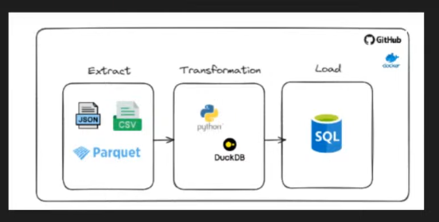

# py_etl_con_duckdb

### Arquitectura del workshop


### Algoritm pipeline
```mermaid
flowchart TD
    A[Inicio] --> B[Cargar variables de entorno]
    B --> C[Descargar archivos de Google Drive]
    C --> D[Conectar a DuckDB]
    D --> E[Inicializar tabla en DuckDB]
    E --> F[Obtener archivos procesados]
    F --> G[Listar archivos CSV, JSON y Parquet]
    G --> H{Archivo no procesado?}
    H --> |Sí| I[Leer archivo]
    I --> J[Transformar DataFrame]
    J --> K[Guardar en PostgreSQL]
    K --> L[Registrar archivo en DuckDB]
    L --> M[Archivo procesado y guardado]
    H --> |No| N[Archivo ya procesado]
    M --> O[Mostrar log]
    N --> O
    O --> P[Fin]

    subgraph Descarga
        C
    end

    subgraph Conexión y Procesamiento
        D
        E
        F
        G
        H
        I
        J
        K
        L
    end

    subgraph Registro
        M
        N
    end

    subgraph Fin
        O
        P
    end;